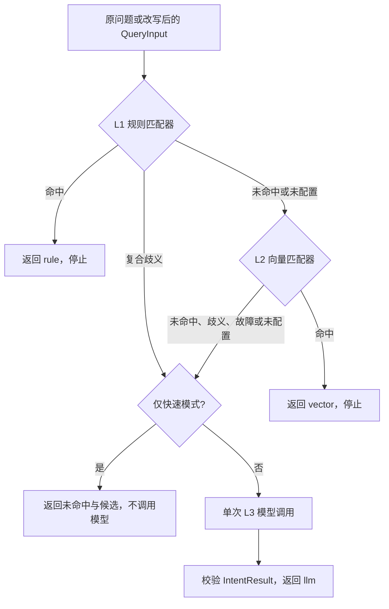

# 012 三层识别、候选与短路契约

> 2026-09-28 已完成**编排和可替换接口**。L1 真实规则在 013、L2 意图样例/embedding/索引在 014、复合意图守卫完善在 015、HTTP 流水线接入在 017。当前运行时不连接向量库；测试以假匹配器控制每一层。

## 需要提前提供向量库配置吗？

**012 不需要。** 这一编号验证 L1 → L2 → L3 的判断顺序和数据契约，假向量 matcher 就能返回固定 Top 候选、分数、阈值与歧义。向量库的端点或本地路径、embedding 模型和凭证、样例索引的构建方式到 014 真正接入时再确定；本步不会把认证用 Redis 或 AgentScope 的 storage 默认为意图向量库。

## 一条权威入口

`IntentRecognizer.recognize(query, fast_only=False)` 现在返回 `RecognitionDecision`。调用者只在这一个入口选择是否允许 L3；分类提示词只存在于 L3 模型服务。`rule_matcher.match()` 是同步、可测试的确定性层；`vector_matcher.match()` 是异步近邻层。任一 matcher 未注入时，调用记录只包含真正执行过的层，默认仍可单独使用 L3；`fast_only=True` 且无快速层会明确返回未命中，不会假装规则已实现。

| 结果字段 | 语义 |
| --- | --- |
| `result` | 008 的 `IntentResult`，其中有序 `intents` 与 `primary_intent` 是类别权威；快速模式未命中时为 `null`。 |
| `hit_layer`、`attempted_layers` | 实际命中的层级与按顺序调用过的层级；`rule`、`vector`、`llm` 分别对应 L1、L2、L3。 |
| `confidence` | 主要意图的置信等级，从 008 结果读取；无命中时为 `null`。 |
| `vector_threshold` | 若 L2 返回匹配结果，则记录它报告的阈值；未尝试或发生检索异常时为 `null`，即使最终命中 L3 也保留已收到的 L2 判定依据。 |
| `candidates` | 已尝试快速层的候选及其来源、分数和理由；L1 没有数值分数，L2 分数限定在 `[0,1]`。LLM 输出不允许自报向量分数或执行角色。 |
| `reason` | L1/L2/L3 的命中、弃权、低于阈值或故障原因；L2 错误只记录异常类名，不输出底层连接字符串。 |

快速匹配器返回 `FastMatch(status, result, candidates, threshold, reason)`，`status` 为 `hit`、`miss` 或 `ambiguous`。命中必须带单意图结果和同类候选；歧义不输出已命中结果。L2 还必须报告本次阈值与候选相似度，低于阈值的候选不能宣称命中。这些字段和跨字段校验集中定义在 [models.py](../../src/gogo_agent/intent/models.py)。

## 分支图



快速模式供未来 017 在**原句**上预判。只有快速层未命中，应用流水线才从业务历史改写问题，并用完整模式重新识别；012 只提供这两个调用能力，尚未把它们接到聊天 HTTP 入口。L1 报复合歧义时跳过 L2，避免把多诉求强行压成向量 Top-1。L2 检索失败会记录故障并进入 L3；规则层自身异常直接抛出，不能伪装成低置信匹配。

## Java 对照与当前实现边界

Java 基线目录是 `/Users/shenmingjie/workSpace/LLMentor-teach/gogo-agent`，下列路径相对 `src/main/java/com/gogo/travel/`：

- `agent/intent/IntentRecognitionRouter.java:69-116`：L0 结构守卫后试 L1；L1 命中短路，歧义跳过 L2，仅未命中试 L2。Python 本步通过 `ambiguous` 状态保留弃权出口，具体守卫词和规则在 013/015 实现。
- `agent/intent/IntentVectorMatcher.java:36-46,101-162`：Java 默认 Top-2、命中阈值 `0.75`，跨类别分差 `<0.05` 弃权；分数 ≥`0.85` 对应高置信。Python 012 的假 matcher 演示这些值，但**没有构建索引、调用 embedding 或实现分差算法**，这些留给 014/015。
- Java 的向量检索故障按未命中进入后续 L3；Python 本步也只在向量层捕获异常，并将原因记录到 `RecognitionDecision.reason`。模型返回非法 JSON 继续抛出 `ModelOutputError`，不会自动归类为 `unknown`。

命中 `reimbursement` 仍只是数据分类；它不意味着报销角色已装配。`target_agent` 和服务端可信 `user_id` 不从模型结果取得，本步也不触发差旅单或预订写入。

## 可检查的验收

```sh
.venv/bin/python -m pytest -q tests/test_012_routing.py tests/test_010_011_intent.py tests/test_008_intent.py
```

[012 测试](../../tests/test_012_routing.py)注入假 L1/L2：分别断言 L1 命中跳过 L2/L3、L2 命中跳过 L3、双层未命中只调用一次 L3、L1/L2 歧义与向量故障进入 L3、快速模式完全不调用 L3。还验证低于阈值却声明命中、来源不符、缺阈值和非法调用参数会明确失败。命令结果为 **114 passed**；测试不需要向量库、真实 embedding 或外网模型。

原有 [真实模型三轮演示](../学习路线/010-011-真实模型实操.md)继续可以运行：未注入 L1/L2 时，识别结果应显示 `hit_layer="llm"`、`attempted_layers=["llm"]`。这说明快速 matcher 尚未连接，不应把其输出解读为已经通过规则或向量识别。
