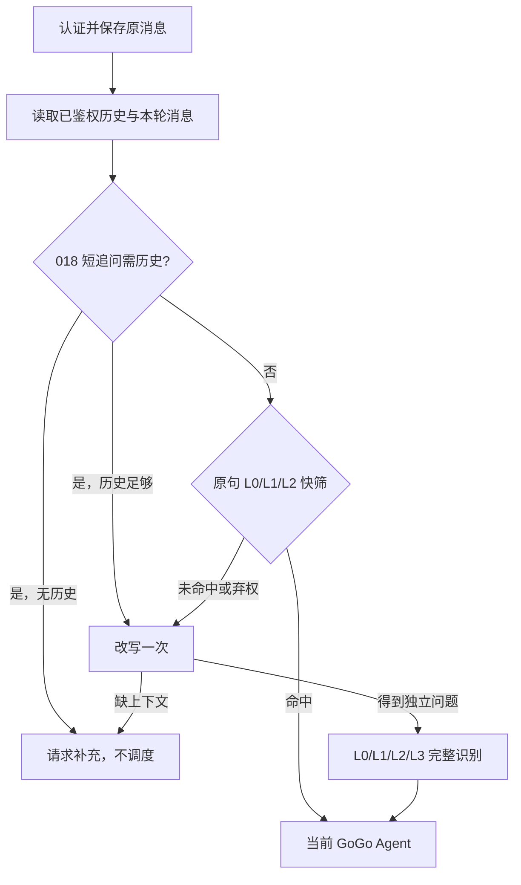

# 016–017 有序执行与意图识别流水线

## 当前执行边界

HTTP `POST /api/chat/{sessionId}` 已在保存原问题之后调用 [`IntentPipelineService.prepare()`](../../src/gogo_agent/intent/pipeline.py)。上下文构造器用服务端传入的 `user_id`、会话和本轮 `message_id` 校验归属。一般请求先在**原句**运行快速层，命中则不改写；未命中才改写一次。018 对含指代或省略动作的短追问增加例外：它们先结合历史改写，以免原句向量高分抢先定类。缺少指代对象时请求补充，不运行当前聊天 Agent。JSON 和 SSE 共用这条预处理路径。



识别结果只把**类别和顺序**作为当前单 Agent 的理解线索，不能授予写入权限。当前 Python 尚无真正的 Master 和业务子 Agent；HTTP 的 `GoGo` 没有差旅单、方案或供应商订单写工具，不能宣称已办理业务。它收到改写后的独立问题，原问题仍保存在业务历史中。助手消息的 `extra.intent_pipeline` 记录 `branch`、快筛/最终尝试层和有序意图；JSON 响应 `{sessionId,messageId,content}` 及 SSE `message`、`message_id` 事件保持原有格式。

016 的 [`OrderedMasterCoordinator`](../../src/gogo_agent/intent/execution.py)是为后续 Master 委派准备的可注入顺序边界。它依 `IntentResult.intents` 的顺序调用假子 Agent，把来源、输出和状态逐项保存；前项失败则后项标为 `skipped`，整轮状态为 `partial` 或 `failed`，不误报全部完成。教学用 `InMemoryWriteLedger` 以可信 `user_id + session_id + request_id + 序号 + 意图` 对同进程的**同一个请求**写调用去重，异常或取消后也不盲目重试。它没有接入 HTTP 真实业务写工具；跨进程持久化幂等和不同 HTTP POST 的重复提交仍须由后续业务工具/订单服务实现。

## 调试 demo

```bash
.venv/bin/python scripts/demo_016_017_pipeline.py
.venv/bin/python scripts/demo_016_017_pipeline.py --case l3
.venv/bin/python scripts/demo_016_017_pipeline.py --case rewrite
```

[`demo_016_017_pipeline.py`](../../scripts/demo_016_017_pipeline.py)直接使用 `.env` 的模型网关、`qwen3.7-text-embedding` 和现有 Qdrant 意图集合；历史与假子 Agent 仅在内存中。每条案例使用独立会话，打印原句快筛、候选分数、改写文本、最终命中层和有序意图。

| 案例 | 输入 | 2026-09-28 实际分支 |
| --- | --- | --- |
| `l0` | `帮我查一下差旅政策，并且报销这张发票` | 原句 L0 强连接词弃权；改写后由 L3 判定多意图 |
| `l1` | `帮我查机票` | `fast`，L1 `flight_search` |
| `l2` | `我交上去那个流程现在走到哪一步了` | `fast`，L2 `approval_query`，Top-1 `1.0` |
| `l3` | `查订单并规划下一程` | 改写后 L3，`travel_order_query → itinerary_planning`；假 Master 按序调用，再次使用同请求 ID 时规划写调用仍为一次 |
| `rewrite` | `那改成三天呢？` | 018 指代守卫先放行改写；从教学历史补成“北京去杭州的三天行程”，完整识别在 L1 命中 `itinerary_planning` |

推荐断点：[`ChatAgentExecutor._prepare_turn`](../../src/gogo_agent/chat/executor.py) 看消息保存与错误出口；[`IntentPipelineService.prepare`](../../src/gogo_agent/intent/pipeline.py) 看 fast/rewritten 分支；[`IntentRuleMatcher.match`](../../src/gogo_agent/intent/rules.py) 看 L0/L1；[`IntentVectorMatcher.match`](../../src/gogo_agent/intent/vector.py) 看 Top-2；[`IntentRecognizer.recognize`](../../src/gogo_agent/intent/service.py) 看 L3 短路；[`OrderedMasterCoordinator.execute`](../../src/gogo_agent/intent/execution.py) 看假子 Agent 顺序与去重。

## 验证和已知边界

运行 `.venv/bin/python -m pytest -q tests/test_016_017_pipeline.py tests/test_005_chat.py -k 'not real_model_e2e_invocation_when_configured'` 可核对快命中零改写、未命中一次改写、有序多意图、部分失败、同请求写调用一次、HTTP JSON/SSE 响应与模型故障出口。预处理失败在 SSE 响应开始前返回 HTTP 503；Agent 流式生成中失败时发送 `event: error`，不发 `message_id` 或保存成功回复。当前聊天模型客户端在每轮结束后关闭。

AgentState 现在按可信用户和会话共同组成存储键，并在会话删除时清理该用户的状态，防止删除后同一会话 ID 被其他用户复用时继承旧上下文。旧版本仅按会话 ID 保存的 AgentState **不会自动迁移或读取**；升级前已有会话的 Agent 内部记忆会从新键重新开始，但业务消息历史仍保留。成功回复先写入业务历史，再写入 AgentState；若业务回复落库失败，不提交新状态。两套存储尚无跨仓储原子事务，若业务回复已保存但随后 AgentState 写入失败，可能留下可见回复而内部记忆未更新；这种失败不会发送 SSE 完成事件。

017 原版曾让“明天去上海呢？”在原句 L2 以约 `0.763` 命中 `flight_search`，跳过历史改写。[018 回归](018-意图误路由修复.md)现让短追问先改写，无历史时请求补充；demo 的 `rewrite` 案例也走这个守卫。真实模型输出可能变化；固定测试只证明编排与契约，真实 demo 记录的是当次运行结果。
