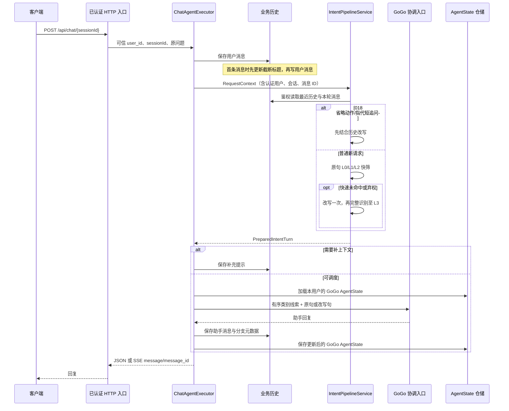
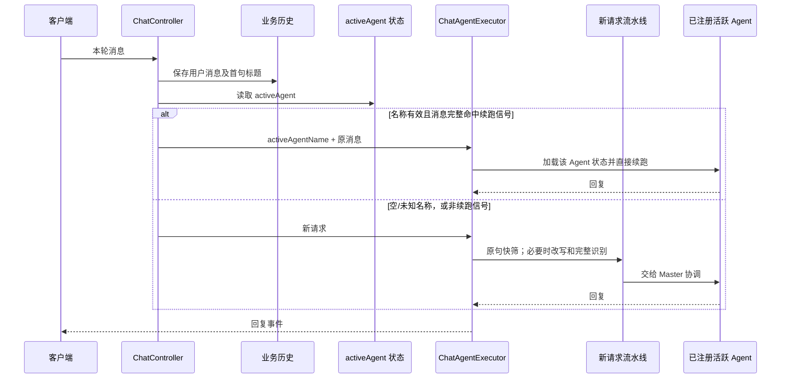

# 020 新请求与活跃 Agent 续跑的执行顺序

## 当前 Python 新请求：实际运行路径



真实入口是 [`ChatAgentExecutor`](../../src/gogo_agent/chat/executor.py)。[测试](../../tests/test_020_execution_order.py)对第一次复合问题记录到精确事件序列：`conversation_created → title_updated → user_saved → history_loaded → rule_checked → rewrite_called → rule_checked → l3_model → state_loaded → coordinator_built → coordinator_replied → assistant_saved → state_saved`。同会话第二轮不会重建会话或重设标题；它仍执行意图流水线，然后加载前一轮保存的 `GoGo` AgentState（测试中上下文长度从 0 变为 2）。**状态恢复不等于活跃子 Agent 直接续跑。**

Python 的标题在首次用户消息保存过程中取前 24 字同步设置，发生在读取改写历史前。当前没有 Java 那个识别完成后的异步模型标题更新。Python 017 的上下文构造器在快筛前就读取最近历史；Java 普通请求的 `chat_message` 历史只在改写分支读取。两者都不会把业务历史读取误认为 AgentScope 内部 AgentState 加载。

## 活跃 Agent 续跑：Java 基线与 Python 020 选择边界



这张图描述 Java 的实际分支，也是 Python 020 注入式续跑入口的调用顺序：Java `ChatController` 在保存消息后读取 activeAgent，只对**整条消息**命中的明确续跑词进入该分支；已注册业务 Agent 可直接续跑，未知名称经 registry 查询失败回完整流水线。Java 的空字符串 `activeAgent` 可能在 registry 的 `charAt(0)` 处抛错，并非安全回退。Java 的 `MasterAgent` 和 `IntentRecognitionAgent` 还有各自的流水线特殊分支，不能把所有 active 名称概括成“直调子 Agent”。Java 高置信直跳新请求的分支仍被注释，不属于这条续跑路径。

Python 当前没有持久化 active-agent 记录、真实 Master/业务子 Agent 或 `/api/chat/respond` 恢复入口。020 的 [`choose_turn_entry`](../../src/gogo_agent/chat/continuation.py) 已由 `ChatAgentExecutor` 的**可注入活跃 Agent 入口**调用：用户消息经归属校验保存后，入口读取活跃名称并核对已注册名称和完整续跑词；有效则交给提供者的 `continue_turn`，不打开 017 识别流水线；名称为空、未知或不是续跑词时运行完整流水线。JSON 和 SSE 保留原响应格式。测试把假活跃 Agent 注入 FastAPI 实际入口，验证直续、无效名称回退、读取异常停止及跨用户 403；默认未注入提供者时仍走现有完整流水线。真实活跃状态存储和业务 Agent 执行由 027 接入，当前不能声称生产 HTTP 已在续跑某个子 Agent。此处只要求服务端已鉴权的 `user_id`，不从用户输入或模型输出接受活跃 Agent 名称；提供者的业务工具权限仍须独立校验。

## 验收命令与边界

先运行离线断点示例，不需要模型网关或 Qdrant：

```bash
.venv/bin/python scripts/demo_020_execution_order.py --case all
.venv/bin/python scripts/demo_020_execution_order.py --case continue
```

`--case` 还可选 `new`、`same`、`fallback`。适合在 [`ChatAgentExecutor.execute_turn`](../../src/gogo_agent/chat/executor.py)、[`IntentPipelineService.prepare`](../../src/gogo_agent/intent/pipeline.py)、[`choose_turn_entry`](../../src/gogo_agent/chat/continuation.py) 和脚本的 `FakeActiveAgent.continue_turn` 打断点。脚本运行真实执行器与流水线，但用固定意图响应、内存仓储和假活跃 Agent；直接调用执行器时传入教学用户 ID，不演示 HTTP Token 鉴权。

```bash
.venv/bin/python -m pytest -q tests/test_020_execution_order.py tests/test_019_routing.py
```

测试检查当前 Python 的完整新请求顺序、同会话 `GoGo` 状态恢复，以及注入假活跃 Agent 后 FastAPI JSON/SSE 的续跑和无效状态回退。标题更新与改写历史的时间点以实际代码和事件记录为准。后续 023 接入 Master/子 Agent、027 接入持久活跃记录时，仍需把假执行者替换为真实业务 Agent 做 HTTP 端到端验收。当前续跑提供者只返回完整文本，SSE 将其作为一个 `message` 事件发送；业务 Agent 的逐 token 流式续跑仍待后续实现。
