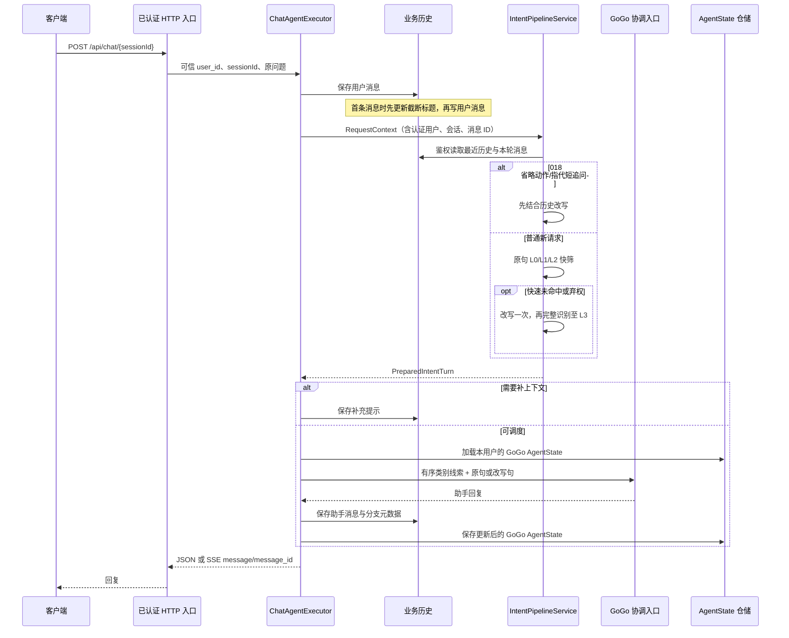
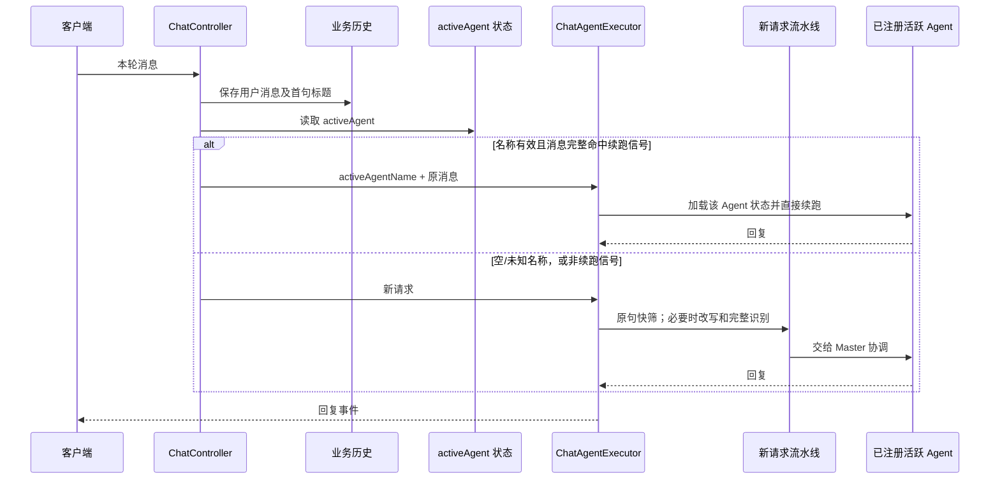

# 020 新请求与活跃 Agent 续跑的执行顺序

## 当前 Python 新请求：实际运行路径



真实入口是 [`ChatAgentExecutor`](../../src/gogo_agent/chat/executor.py)。[测试](../../tests/test_020_execution_order.py)对第一次复合问题记录到精确事件序列：`conversation_created → title_updated → user_saved → history_loaded → rule_checked → rewrite_called → rule_checked → l3_model → state_loaded → coordinator_built → coordinator_replied → assistant_saved → state_saved`。同会话第二轮不会重建会话或重设标题；它仍执行意图流水线，然后加载前一轮保存的 `GoGo` AgentState（测试中上下文长度从 0 变为 2）。**状态恢复不等于活跃子 Agent 直接续跑。**

Python 的标题在首次用户消息保存过程中取前 24 字同步设置，发生在读取改写历史前。当前没有 Java 那个识别完成后的异步模型标题更新。Python 017 的上下文构造器在快筛前就读取最近历史；Java 普通请求的 `chat_message` 历史只在改写分支读取。两者都不会把业务历史读取误认为 AgentScope 内部 AgentState 加载。

## 活跃 Agent 续跑：Java 基线与 Python 020 选择边界



这张图描述 Java 的实际分支，也是 Python 020 注入式续跑入口的调用顺序：Java `ChatController` 在保存消息后读取 activeAgent，只对**整条消息**命中的明确续跑词进入该分支；已注册业务 Agent 可直接续跑，未知名称经 registry 查询失败回完整流水线。Java 的空字符串 `activeAgent` 可能在 registry 的 `charAt(0)` 处抛错，并非安全回退。Java 的 `MasterAgent` 和 `IntentRecognitionAgent` 还有各自的流水线特殊分支，不能把所有 active 名称概括成“直调子 Agent”。Java 高置信直跳新请求的分支仍被注释，不属于这条续跑路径。

020 演示自身仍注入假 `PlanAgent`，不装配持久活跃记录或 `/api/chat/respond` 恢复入口；023 另行接入 GoGo 对只读 InfoAgent 的委派。020 的 [`choose_turn_entry`](../../src/gogo_agent/chat/continuation.py) 已由 `ChatAgentExecutor` 的活跃入口调用：用户消息经归属校验保存后，只对已注册名称与完整续聊词直接续跑，否则进入完整流水线。027 现已在正式执行器默认装配真实 `InfoAgentContinuation`，并按认证用户+会话保存活跃项和子 AgentState；同会话 Info 续聊的实际 HTTP/JSON/SSE 演示见[027 指南](027-活跃InfoAgent续跑.md)。020 的测试替身仍保留用于解释分支；它不代表生产已有 `PlanAgent`。活跃名称不从用户输入或模型输出获取，未来业务 Agent 的工具权限仍须独立校验。

## 验收命令与边界

先运行离线断点示例，不需要模型网关或 Qdrant：

```bash
.venv/bin/python scripts/demo_020_execution_order.py --case all
.venv/bin/python scripts/demo_020_execution_order.py --case continue
```

`--case` 还可选 `new`、`same`、`fallback`。适合在 [`ChatAgentExecutor.execute_turn`](../../src/gogo_agent/chat/executor.py)、[`IntentPipelineService.prepare`](../../src/gogo_agent/intent/pipeline.py)、[`choose_turn_entry`](../../src/gogo_agent/chat/continuation.py) 和脚本的 `FakeActiveAgent.continue_turn` 打断点。脚本运行真实执行器与流水线，但用固定意图响应、内存仓储和假活跃 Agent；直接调用执行器时传入教学用户 ID，不演示 HTTP Token 鉴权。

```bash
.venv/bin/python -m pytest -q tests/test_020_execution_order.py tests/test_019_routing.py
```

测试检查 Python 的完整新请求顺序、同会话 `GoGo` 状态恢复，以及注入假活跃 Agent 后 FastAPI JSON/SSE 的续跑和无效状态回退。标题更新与改写历史的时间点以实际代码和事件记录为准。027 已用真实 InfoAgent 替换这条路径的生产提供者，见[027 测试](../../tests/test_027_active_info.py)；其他业务 Agent 仍未注册。当前续跑提供者只返回完整文本，SSE 将其作为一个 `message` 事件发送；逐 token 流式续跑仍待后续实现。

## Java 工程师逐步调试：从运行到能自己解释

这一节按「准备环境 → 找到入口 → 单步首轮 → 对照其余三种分支 → 自测」来做。先照步骤操作，再回头读上面的两张序列图。完成后，你应该能不看答案说清三件事：本轮问题何时保存、`pipeline_factory` 何时真正执行、同会话恢复与活跃 Agent 续跑为什么是两条路径。

### 第 0 步：把示例跑起来

1. 在终端进入 **Python 工程根目录**，确认这里能看到 `AGENTS.md`、`src/` 和 `scripts/demo_020_execution_order.py`。下面所有命令都从该目录运行。
2. 使用工程的 `.venv/bin/python`。若该文件不存在，先按根目录 [README 的环境与启动](../../README.md#环境与启动)运行 `uv run --locked gogo-agent --health`，让 `uv` 创建环境并安装锁定依赖。
3. 先复制这一条命令，不用准备数据库、Qdrant 或模型密钥：

   ```bash
   PYTHONPATH=src .venv/bin/python scripts/demo_020_execution_order.py --case new
   ```

   `PYTHONPATH=src` 让 Python 找到 `src/gogo_agent`；`.venv/bin/python` 指定本工程解释器；`--case new` 只展示首轮请求。预期进程退出码为 0，关键事件依次为 `user_saved → history_loaded → rule_checked → rewrite_called → rule_checked → l3_model → state_loaded → gogo_replied → assistant_saved → state_saved`。`请求 ID` 与 `追踪 ID` 每次都会变化，不要照抄它们的具体值。

如果使用 IDE 的 Debug 配置，按下表填写；代码断点直接打在后面列出的语句上。不要把整个仓库或 `src/` 误设为 Script path。

| 配置项 | 填写内容 |
| --- | --- |
| Python interpreter | 工程根目录下的 `.venv/bin/python` |
| Script path / Program | 工程根目录下的 `scripts/demo_020_execution_order.py` |
| Working directory / cwd | 工程根目录 |
| Environment | `PYTHONPATH=src`；如果 IDE 不解析相对值，填工程根目录的绝对路径加 `/src` |
| Parameters / Arguments | 首次填 `--case new`，后续只替换最后的场景名 |

IDE 的 **Step Into** 用来进入项目函数，**Step Over** 用来执行当前语句并停在下一句。进入 `async with` 时可能先看到 Python 标准库的包装代码；直接在本脚本的 `pipeline_factory()` 函数体打断点，就能跳到要学的组装代码。`asyncio.run(run(...))` 为本次脚本运行建立一个事件循环；每个 `await` 都在这个运行过程里等待异步步骤，不会为每一轮新建事件循环。

### 第 1 步：先把 Java 和 Python 的职责对上

下表的 Java 路径相对于**另一个 Java 基线工程**，不是本 Python 仓库。它们承担相近职责，但代码层次没有逐类一一对应。

| 你在 Java 工程里熟悉的步骤 | 本示例中停在哪里 | 需要记住的差别 |
| --- | --- | --- |
| `src/main/java/com/gogo/travel/controller/ChatController.java` 的 `chat()`：保存用户消息、读取 activeAgent、判断续跑词 | [Python 执行器](../../src/gogo_agent/chat/executor.py) 的 `execute_turn()`：先 `_save_user_turn()`，再 `_active_agent_for_turn()` | 此脚本直接调用执行器，绕过 Python HTTP 路由和 Token 鉴权；Python 的分支选择目前在执行器里。 |
| `agent/service/ChatAgentExecutor.java` 的 `executeAgent()`：选择完整流水线或调用指定 Agent | Python `ChatAgentExecutor.execute_turn()`：续跑分支直接返回，否则调用 `_prepare_turn()` 后运行 GoGo | Java 通过传入的 Agent 与 `Mono` 链选择路径；Python 用 `await` 等待当前分支结果。 |
| `agent/service/AgentPipelineService.java` 的 `executeFullPipeline()`：快筛、必要时改写识别，并继续调度 | [Python 流水线](../../src/gogo_agent/intent/pipeline.py) 的 `IntentPipelineService.prepare()`：产出 `PreparedIntentTurn` | Python 的 `prepare()` 只准备问题和识别结果；随后由执行器加载 GoGo 状态并调用 GoGo。 |
| Spring/JUnit 中手动注入 Repository、Service 或测试替身 | [演示脚本](../../scripts/demo_020_execution_order.py) 的 `run()` 创建 `history`、`states`、两个 `OfflineExecutor` | 两个执行器共用同一份内存历史与状态；这里的构造动作不等于已经执行一轮聊天。 |

把本脚本当作一个可以单步走的 Java 集成测试入口：`run()` 相当于手动组装测试夹具，`Recording*` 类像在真实内存实现外围加调用轨迹，`Fixed*` 和 `FakeActiveAgent` 是特意替换外部能力的测试替身。`events` 是调用轨迹列表，**不是**业务消息表，也**不是** AgentState。

```text
main() 解析 --case
  asyncio.run(run(selected))
    创建 history / states / events
    创建普通 executor 与带 FakeActiveAgent 的 active_executor
    execute_turn(message)
      保存用户消息 → 创建 RequestContext
      判断活跃续跑入口
      ├─ 有效名称 + 完整续跑词 → continue_turn() → 保存助手消息
      └─ 其他情况 → _prepare_turn()
            async with pipeline_factory(history_service) as pipeline
              yield IntentPipelineService(...) → await pipeline.prepare(request)
            加载 GoGo AgentState → GoGo.reply()
            保存助手消息 → 保存 GoGo AgentState
```

这里有三种容易混在一起的「记忆」：

| 名称 | 示例中的对象 | 记录什么 | 本轮何时读/写 |
| --- | --- | --- | --- |
| 业务聊天历史 | `history` / `RecordingHistoryRepository` | 已保存的用户消息和助手消息；供改写时读取 | 用户消息先写；`RewriteContextBuilder` 随后读；回复后写助手消息 |
| GoGo 的 AgentState | `states` / `RecordingStateStore` | GoGo 内部的上下文 `state.context`；内存实现用 JSON 保存 | 完整流水线准备完后加载；GoGo 回复并保存助手消息后再保存 |
| 活跃 Agent 名称 | `active.active_name` | 演示用的路由选择值，初始就是 `PlanAgent` | 只有 `active_executor` 查询；本示例没有生产级活跃状态持久化 |

`events.clear()` 只清空第一列之外的**观察列表**，不会重建 `history`、`states` 或 `active`。这正是下一轮还能读到上轮消息和 GoGo 状态的原因。

### 第 2 步：把 `pipeline_factory` 按时间拆开

先在 [脚本的 `pipeline_factory()`](../../scripts/demo_020_execution_order.py) 里找到 `@asynccontextmanager`、四个构造语句和 `yield pipeline`，再在 [执行器的 `_prepare_turn()`](../../src/gogo_agent/chat/executor.py) 找到 `async with self._pipeline_factory(self._history_service) as pipeline:`。按下面的时间线单步，不要把「定义函数」「构造工厂对象」「进入工厂」混成一件事。

| 时刻 | 实际发生的事 | Java 工程师可以怎样理解 |
| --- | --- | --- |
| ① `run()` 执行到 `async def pipeline_factory` | 定义一个局部函数。它能访问外层同一个 `events` 列表；函数体还没执行。 | 类似创建一个捕获外部变量的工厂回调；捕获的是列表对象引用，不是事件快照。 |
| ② 构造两个 `OfflineExecutor` | 把 `pipeline_factory` 这个可调用对象存入执行器的 `_pipeline_factory`。 | 类似构造器注入 `Function<HistoryService, ...>`；此时没有读历史，也没有调用 L3。 |
| ③ `_prepare_turn()` 调用 `_pipeline_factory(self._history_service)` | 得到一个异步上下文管理器；随后 `async with` **进入**时才运行工厂函数体。 | 可把 `async with` 想成异步资源作用域。与 Java `try-with-resources` 相似的是进入/退出边界，具体协议不同。 |
| ④ 创建 `context_builder` | `RewriteContextBuilder(history_service)` 保存历史服务引用，尚未读消息。 | 类似 `new RewriteContextBuilder(historyService)`；构造器注入不等于调用查询方法。 |
| ⑤ 创建 `rewriter` 与 `recognizer` | 前者保存同一个 `events`；后者装入固定 L3 模型和会记录事件的真实规则包装器。 | 类似装配测试 Bean；固定模型只在 `_call_api()` 被调用时返回结果。这里没有装配向量 matcher。 |
| ⑥ 创建 `IntentPipelineService` 并 `yield pipeline` | 三个依赖被装入流水线；`yield` 把这个对象交给 `async with ... as pipeline` 的 `pipeline` 变量。 | 可以理解为把作用域中的资源交给调用方使用；`yield` 不是立即执行识别。 |
| ⑦ 执行 `await pipeline.prepare(request)` | 这时才读取历史、快筛、必要时改写和完整识别。 | 类似在完成依赖注入后显式调用 Service 方法。 |
| ⑧ 离开 `async with` | 工厂从 `yield` 后恢复并结束；演示工厂没有额外清理语句。之后执行器才加载 GoGo 状态。 | 生产 [默认工厂](../../src/gogo_agent/intent/runtime.py) 在退出时关闭 Qdrant、embedding 和文本模型客户端；演示工厂没有这些资源。 |

**断点上的一个关键判断：**停在 `yield pipeline` 时，`events` 中还不应该因为这些构造语句出现 `history_loaded`、`rule_checked` 或 `l3_model`。这些事件属于下一步的 `prepare()`。若你在 `--case continue` 下仍第一次命中这里，先看下节的前置轮次表：那是准备会话的首轮，目标续跑轮次不会再次进入这里。

### 第 3 步：按断点表单步跑 `--case new`

重新以 `--case new` 启动 Debug。下表里的「看什么」写的是**停在该语句执行后**或进入所列函数体时应观察的值；UUID 形式的 ID 每次不同。尽量在对应语句上打断点，按顺序继续。

| 顺序 | 断点打在 | 看什么、应看到什么 | 为什么会到下一站 |
| --- | --- | --- | --- |
| 1 | 脚本 `run()` 创建 `history`、`states` 后 | `events == []`；两个执行器构造完成后，`executor._history_service is active_executor._history_service` 和两个 `_session_store` 的对象身份比较都应为 `True`。 | 一份内存会话供多轮使用。 |
| 2 | 执行器 `execute_turn()` 的 `request = self._save_user_turn(...)` 执行后 | `request.user_id == "demo-user"`、`request.session_id == "learning-020"`、`request.request_id` 是本轮新生成的消息 ID；`events` 已出现 `conversation_created → title_updated → user_saved`。 | 先保存本轮问题，历史构造器才有可靠的「当前消息」。 |
| 3 | 同一函数的 `active_name = self._active_agent_for_turn(...)` 执行后 | 普通 `executor` 没有注入活跃提供者，故 `active_name is None`。 | 进入 `_prepare_turn()`，不是直接续跑。 |
| 4 | `_prepare_turn()` 的 `async with ... as pipeline`，以及脚本工厂的 `yield pipeline` | `history_service is history`；`context_builder`、`rewriter`、`recognizer` 已创建；`events` 暂无 `history_loaded`。 | `yield` 将流水线交回执行器，然后执行 `pipeline.prepare(request)`。 |
| 5 | [流水线](../../src/gogo_agent/intent/pipeline.py) `prepare()` 的 `context = self._context_builder.build_rewrite_context(...)` 执行后；可单步进入[历史构造器](../../src/gogo_agent/intent/context.py) | 回到 `prepare()` 后，`context.query.question == "查订单并规划下一程"`，首轮 `context.history == []`；`events` 新增 `history_loaded`。 | 当前消息已经保存，但它从「此前历史」中排除。 |
| 6 | `IntentPipelineService.prepare()` 中第一次快筛返回后、改写返回后 | `fast.result is None`，因此调用 `FixedRewriter.rewrite()`；`rewrite.rewritten_question` 仍是原句。 | 复合问题未被本次规则快筛直接确定，固定改写器保留原句，再进入完整识别。 |
| 7 | `FixedIntentModel._call_api()` 以及 `prepare()` 返回处 | 先看到第二次 `rule_checked`，再看到 `l3_model`；固定结果含「订单查询、行程规划」两个意图，主意图为行程规划；返回后的 `prepared.branch == "rewritten"`。 | 模型替身只给固定响应，真实解析与分支判断仍由项目代码完成。 |
| 8 | `OfflineExecutor._build_agent()` 与包装后的 `record_reply()` | `state_context_messages=0`；随后出现 `gogo_replied`。 | 首轮没有旧 GoGo 状态，回复使用本地 GoGo 模型替身。 |
| 9 | 执行器保存回复和状态的两条语句、最后到 `show()` | 先 `assistant_saved`，后 `state_saved`；`latest.agent_name == "GoGo"`。 | 完整流水线分支把本轮助手消息与更新后的 GoGo 状态依次写入内存实现。 |

第 6、7 站的 `rule_checked` 出现两次：一次是 `recognize(..., fast_only=True)` 的原句快筛；一次是改写后的完整 `recognize(...)`。本演示只注入了规则 matcher，没有向量 matcher，因此这段输出**不能**证明 Qdrant/L2 向量检索已经运行。第二次规则检查后才使用固定 L3 模型。

下面把 `--case new` 的整条事件逐个翻译。事件名是方便观察的标签；例如 `user_saved`、`state_saved` 都是在包装器调用 `super()` **之前**记入列表，单看事件不能证明写入已完成。脚本正常结束并且下一轮能恢复数据，才进一步证明本次内存路径可用。

| 输出顺序 | 事件 | 谁记录、表示什么 |
| --- | --- | --- |
| 01 | `conversation_created` | 历史仓储准备创建新会话。 |
| 02 | `title_updated` | 首条问题用于设置会话标题；同会话第二轮不会再出现。 |
| 03 | `user_saved` | 进入保存用户消息的仓储调用。 |
| 04 | `history_loaded` | 改写上下文构造器读取本轮消息及可用历史。 |
| 05 | `rule_checked` | 对原句做第一次快速规则检查。 |
| 06 | `rewrite_called` | 快筛未命中后调用固定改写器；本例保留原句。 |
| 07 | `rule_checked` | 对改写结果做第二次、完整模式下的规则检查。 |
| 08 | `l3_model` | 固定意图模型返回双意图 JSON，真实识别器负责解析。 |
| 09 | `state_loaded` | 意图准备结束后加载 GoGo AgentState；首轮没有旧状态。 |
| 10 | `coordinator_built` | 创建本轮 GoGo 协调 Agent。 |
| 11 | `state_context_messages=0` | 加载到的 GoGo 内部上下文长度为 0；这不是聊天历史条数。 |
| 12 | `gogo_replied` | GoGo 的 `reply()` 被调用。020 单元测试使用 `coordinator_replied` 作为同一阶段的另一种观察标签。 |
| 13 | `assistant_saved` | 进入保存助手消息的仓储调用；持久化消息的 `role` 为 `agent`。 |
| 14 | `state_saved` | 进入保存更新后 GoGo AgentState 的仓储调用。 |

### 第 4 步：同一份代码切换三种场景

只改 Debug 参数最后的 `--case` 值，重新启动**一个新进程**。每次启动都会新建一套内存仓储；同一次运行内部的轮次则共用它们。先看这张表，避免被「只打印目标场景」误导：

| 参数 | 本进程实际执行的轮次 | 哪些轮次会展示事件 | `pipeline_factory` 断点会命中几次 |
| --- | --- | --- | --- |
| `new` | 普通首轮 | 首轮 | 1 次 |
| `same` | 普通首轮 → 同会话第二轮 | 只展示第二轮 | 2 次，第一次是准备轮次 |
| `continue` | 普通首轮 → 有效 PlanAgent 续跑 | 只展示续跑轮 | 1 次，只在准备轮次命中；目标续跑轮不命中 |
| `fallback` | 普通首轮 → 有效续跑 → 无效名称回退 | 只展示最后一轮 | 2 次，首次准备、再次回退；中间的有效续跑不命中 |
| `all` | 上述四轮连续执行 | 全部展示 | 3 次：首轮、同会话第二轮、无效名称回退 |

**`same`：**在第二轮的 `execute_turn()` 看 `active_name is None`，所以它仍进入 `pipeline_factory` 和 `prepare()`；在 `OfflineExecutor._build_agent()` 看 `state_context_messages=2`，表示加载了首轮 GoGo 回复后保存的上下文。业务历史也包含首轮用户和助手消息，但「历史读取」和「AgentState 恢复」发生在不同位置。若用 Java 思路看，它是同一会话继续用 GoGo 协调，并非按 activeAgent 名称直调子 Agent。

**`continue`：**准备轮次结束后，目标轮的输入是完整的续跑词 `"继续"`，`FakeActiveAgent.get_active_agent()` 返回已注册的 `PlanAgent`。[续跑选择规则](../../src/gogo_agent/chat/continuation.py) 要求名称在 `available_agents` 中，且**整条消息**命中续跑词。目标轮依次记录 `user_saved → active_lookup → active_agent_replied → assistant_saved`；没有 `history_loaded`、`state_loaded`、`state_saved`。它仍保存业务用户消息和助手消息，但不加载或更新 GoGo AgentState。`PlanAgent` 名称从演示替身的构造器来，不是从首轮 GoGo 状态恢复出来的。

**`fallback`：**脚本先悄悄执行一轮普通请求和一轮有效续跑，再把 `active.active_name` 改成未注册的 `StaleAgent`。目标轮虽然出现 `active_lookup`，`choose_turn_entry()` 仍返回完整流水线入口；接着重新出现 `history_loaded → rule_checked → rewrite_called → rule_checked → l3_model`，最后保存 GoGo 回复与状态。单独运行 `fallback` 时目标轮的 `state_context_messages=2`；运行 `all` 时它为 `4`，因为 `all` 额外执行了可见的同会话第二轮。中间那轮 PlanAgent 回复写进业务历史，却没有给 GoGo AgentState 增加上下文。

### 第 5 步：先猜，再用命令验答案

先遮住每题的「答案」一行，口头说出**会走哪条分支、哪个断点会命中、为什么**，再复制命令运行。能解释原因比背事件名称更重要。

1. **同会话第二轮会跳过 `pipeline_factory` 吗？**

   ```bash
   PYTHONPATH=src .venv/bin/python scripts/demo_020_execution_order.py --case same
   ```

   答案：不会。普通执行器没有活跃 Agent 提供者；第二轮仍准备意图，工厂总共命中两次。第二轮恢复的 `state_context_messages=2` 属于 GoGo AgentState，不会替代意图流水线。

2. **有效续跑会不会加载和保存 GoGo AgentState？为什么工厂断点还会命中一次？**

   ```bash
   PYTHONPATH=src .venv/bin/python scripts/demo_020_execution_order.py --case continue
   ```

   答案：目标续跑轮不会加载或保存 GoGo 状态，也不进工厂；工厂的那一次命中属于脚本先执行的普通首轮。看目标轮打印的四个事件，只有业务消息保存和假 PlanAgent 回复。

3. **无效活跃名称会怎样处理？为什么 `fallback` 单独运行与 `all` 的上下文长度不同？**

   ```bash
   PYTHONPATH=src .venv/bin/python scripts/demo_020_execution_order.py --case fallback
   PYTHONPATH=src .venv/bin/python scripts/demo_020_execution_order.py --case all
   ```

   答案：`StaleAgent` 不在已注册集合中，目标轮回完整流水线；单独运行时 GoGo 只完成过首轮，长度为 `2`；`all` 里 GoGo 已完成首轮和同会话第二轮，长度为 `4`。`events.clear()` 只清观察列表，不清会话或状态。

4. **停在 `yield pipeline` 时已经发生历史读取或 L3 调用了吗？**

   答案：没有。`yield` 只把组装好的服务交给执行器；`await pipeline.prepare(request)` 才会调用历史构造器、规则、改写和模型。离开 `async with` 后才进入 GoGo 状态加载。

### 完成标准与常见卡点

完成本编号时，用自己的话说出 `main → run → execute_turn → _prepare_turn → pipeline_factory → prepare → GoGo` 的调用方向；能在 `new` 场景逐项解释 14 个事件；能预测 `same`、`continue`、`fallback` 的工厂命中次数及状态变化；能指出哪几个组件是真实实现、哪几个是替身。推荐最后再运行一次 `--case all`，用输出逐项核对上表。

| 遇到的情况 | 先检查什么 |
| --- | --- |
| 找不到 `gogo_agent` 模块 | 工作目录是否是仓库根目录，环境变量是否为 `PYTHONPATH=src`。 |
| `.venv/bin/python` 不存在 | 先执行 README 的 `uv run --locked gogo-agent --health` 环境准备命令。 |
| 调试 `continue` 却在工厂断点停下 | 先确认是否还在脚本提示的「准备轮次」；继续运行到目标轮后，工厂不会再命中。 |
| `请求 ID`、`追踪 ID` 与文档不同 | 它们逐轮生成，本来就不固定；核对事件顺序、分支和状态长度。 |
| 看见 `state_saved` 就以为数据库已提交 | `RecordingStateStore` 先记事件再调用内存父类；本脚本没有数据库。可结合下一轮恢复结果验证内存写入。 |
| 想验证真实模型、Qdrant 或 HTTP Token | 本脚本固定了模型响应、没有向量 matcher，也绕过 HTTP；应另走对应的集成验收，不能从这里推断生产结果。 |
