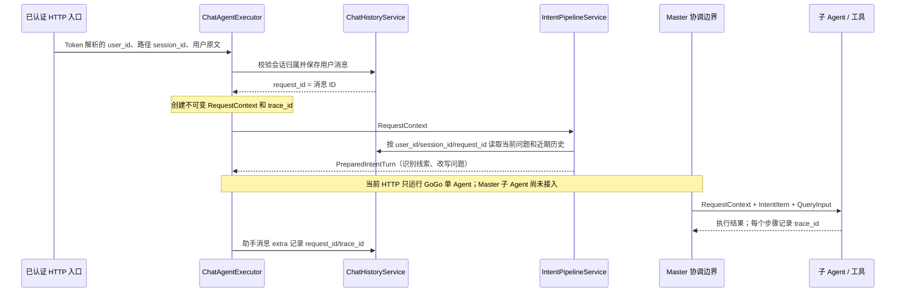

# 021 多 Agent 请求上下文与信任边界

## 一轮请求的数据从哪里来



当前 HTTP 实际执行 [`ChatAgentExecutor`](../../src/gogo_agent/chat/executor.py) → [`IntentPipelineService`](../../src/gogo_agent/intent/pipeline.py) → `GoGo`。图中的 Master → 子 Agent 是 016 假协调器的已实现接口与 021 验收边界；023 才装配真实 Master 和业务子 Agent。有效活跃 Agent 续跑也收到同一个 `RequestContext`，但当前只在注入测试提供者时运行。

| 数据 | 来源及校验 | 给模型看的内容 | 服务/工具使用 |
| --- | --- | --- | --- |
| `user_id` | `Authorization` Token 经 `get_current_user` 解析 | 不放入提示词或 `UserMsg` | 会话归属、AgentState 隔离、工具读取/写入的账户依据 |
| `session_id` | HTTP 路径；保存/读取业务历史时校验归属 | 不作为身份提示交给模型 | 业务历史、AgentState 和子 Agent 会话定位 |
| `request_id` | 已保存用户消息的 ID | 不交给模型 | 找回本轮消息、写调用去重、回复元数据 |
| `trace_id` | 服务端每轮生成 | 不交给模型 | 回复元数据、协调报告与每个子步骤关联 |
| `plan_reference` | 只有服务端验证计划归属后才能设置；当前 HTTP 请求为空 | 不采信模型自报的计划 ID | 后续业务工具定位已授权的计划 |
| `IntentResult`、`effective_question` | L0–L3 与问题改写的结果，属于模型/规则生成的业务线索 | 类别顺序放在 `GoGo` 提示词；问题文本作为 `UserMsg` | 仅决定理解与委派顺序，不授予身份、审批或写权限 |
| 用户消息、历史、模型生成文本 | 用户或模型可控制 | 按需供改写和 Agent 推理 | 当作不可信输入；其中的 `userId`、`planReference` 不能覆盖上下文 |

[`RequestContext`](../../src/gogo_agent/request_context.py) 用 `frozen=True` 和 `extra="forbid"` 防止传递途中改字段、混入未声明字段。它的可信性还取决于**构造位置**：HTTP 只在 Token 鉴权且消息经会话归属校验保存后构造它。Python 代码若自行伪造实例，Pydantic 本身不能替代入口鉴权。日志或外部响应也不应回显用户资料和 Token；当前只把 `request_id`/`trace_id` 放进助手消息 `extra`。

## 与 Java 基线的对应

Java `AgentSessionContext` 持有 `userId`、`sessionId`、城市差标、联系人、常驻地、差旅订单 ID 和缓存订单等服务端数据。实际通过 `AgentSessionContextHolder` 显式绑定普通 `ThreadLocal` 并在调用结束清理；021 原文称 TTL 自动传播，与现有 Java 源码不符。Java 的意图/改写是另行构造的模型可见消息，计划存储也独立于此上下文。Python 021 因而先用显式参数传身份与追踪，不照搬线程上下文；`contextvars` 的并发/后台任务生命周期留给 022。

## 验收与边界

先运行离线断点示例，不需要现网 Token、模型网关或 Qdrant：

```bash
.venv/bin/python scripts/demo_021_request_context.py
```

适合在 [`ChatAgentExecutor._save_user_turn`](../../src/gogo_agent/chat/executor.py)、[`IntentPipelineService.prepare`](../../src/gogo_agent/intent/pipeline.py)、[`OrderedMasterCoordinator.execute`](../../src/gogo_agent/intent/execution.py) 和脚本的 `FakeProfileTool.read` 打断点。脚本先用内存 Alice 账号的本地 Token 进入 FastAPI，再把捕获的上下文交给假协调器；HTTP 仍只运行 GoGo，后半段是假 Master/子 Agent/工具的独立教学调用。

```bash
.venv/bin/pytest -q tests/test_021_request_context.py tests/test_016_017_pipeline.py tests/test_020_execution_order.py
```

测试用 Alice 的真实登录 Token 进入 FastAPI，在用户消息里放 Bob 的 `userId` 和外来计划引用；流水线收到的仍是 Alice 的 `RequestContext`。假子 Agent 把原文里的伪造 ID 当作模型参数交给假资料工具，工具只按 `context.user_id` 读取 Alice，两个执行步骤及整轮报告保留同一个 `trace_id`。这验证了当前边界的传参方式；尚未验证未来真实业务工具的授权实现，也没有把 016 假协调器接入生产 HTTP。
