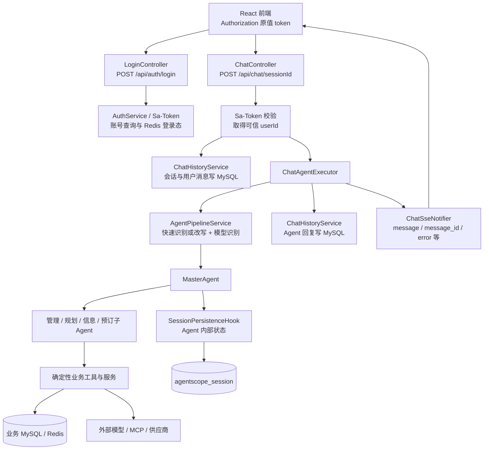
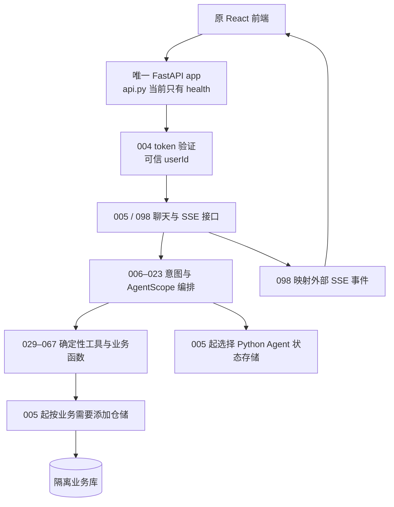

# 003 整体架构与 HTTP 入口

记录日期：2026-09-24。Java 对照目录为 `/Users/shenmingjie/workSpace/LLMentor-teach/gogo-agent`（读取时 HEAD `9b5a8ec`）。以下 `controller/`、`agent/`、`business/`、`config/` 路径相对该项目的 `src/main/java/com/gogo/travel/`。这是源码核对与 Python 架构选择；Java 服务未启动。具体脱敏请求、响应与风险见 [002 静态契约](../契约样例/002-用户旅程静态契约.md)。

## 选择的 HTTP 入口

**唯一入口是 `gogo_agent.api:app`（FastAPI）。** 目前只注册 `GET /health`，可用 `uv run --locked uvicorn gogo_agent.api:app --host 127.0.0.1 --port 8000` 启动。终端练习 `gogo-agent` 仍单独调用 AgentScope SDK，不是第二个 HTTP 服务。登录、聊天和业务路由按对应编号实现后，再注册到这个应用；003 不创建无鉴权的占位业务接口。

| 方案 | 当前前端契约的适配成本 | 身份与存储入口 | 003 结论 |
| --- | --- | --- | --- |
| 项目自己的 FastAPI 应用 + AgentScope SDK | 可在原 `POST /api/chat/{sessionId}` 响应上发送 SSE，并保留 `/api/auth`、`/api/my-travel` 等路由形状；004/005/098 实现具体逻辑。 | 004 从 `Authorization: <token>` 验证用户，005 按可信 `userId` 保存业务历史；Agent 状态单独存。 | **采用**。与前端已有请求形状一致，当前阶段只需一个应用入口。 |
| AgentScope 2.0.8 自带 Agent Service | 安装包的 `POST /chat/` 只触发任务，事件另由 `GET /sessions/{session_id}/stream` 订阅，需转换现有的同一个 POST SSE 流与会话路由。 | `create_app` 需 `storage`、`message_bus`、`workspace_manager`；默认 `get_current_user_id` 直接读取客户端的 `X-User-ID`，这是占位身份，不是认证。当前项目未安装 `agentscope[service]` 全部可选依赖，直接导入 `agentscope.app` 缺 `apscheduler`。 | 暂不采用其 HTTP 入口；其 `Agent`/`Toolkit` SDK 仍用于编排。若以后改选，需要先实现真实鉴权并逐项验证前端协议。 |

对照依据：Java `controller/ChatController.java:54-56` 与 `frontend/src/api/chat.ts:15-29,40-80`；当前安装包 `.venv/lib/python3.12/site-packages/agentscope/app/_router/_chat.py:42-65`、`_router/_session.py:776-787`、`app/deps.py:33-55`、`app/_app.py:78-104`，以及 `agentscope-2.0.8.dist-info/METADATA` 的 `service` extra。Agent Service 官方[架构文档](https://docs.agentscope.io/latest/en/deploy/agent-service)也描述其独立会话流与占位身份；该链接当前指向 2.0.9dev，因此本表具体 API 以本地锁定的 2.0.8 安装包为准。

## 一个登录后发消息的场景

**Java 当前执行路径**（普通新话题；续聊命中 active agent 时有旁路）：

1. **身份来源**：`ChatController.chat` 用 `StpUtil.getLoginIdAsString()`，将 `userId` 与 `sessionId` 写入 `AgentSessionContext`；`ChatRequest` 只有 `message`，不提供可信身份。身份经过 Reactor context、Agent 构建时的 ThreadLocal 投影和工具上下文传递。依据：`controller/ChatController.java:54-83`、`agent/service/AgentPipelineService.java:206-223,315-319`、`agent/MasterAgent.java:66-77`、`agent/context/AgentSessionContext.java:10-15`。
2. **接口与编排**：Controller 先写用户消息；Executor 对普通请求调用 `executeFullPipeline`。L1/L2 命中跳过改写，未命中进入 `QueryRewritingAgent` 和 `IntentRecognitionAgent`；两条分支最终都调用 `MasterAgent`，其 Toolkit 再注册管理、规划、信息和预订子 Agent。高置信单意图直跳调用已注释。依据：`controller/ChatController.java:65-95`、`agent/service/ChatAgentExecutor.java:122-145`、`agent/service/AgentPipelineService.java:134-156,163-195,206-223`、`agent/MasterAgent.java:83-126`。
3. **写入点**：`ChatHistoryService` 写 `chat_conversation`、`chat_message`；`SessionPersistenceHook` 另以 `sessionId:agentName` 保存 Agent 内部状态到 `agentscope_session`；工具可写差旅、审批和预订业务表或调用外部服务。两种历史的序列化格式不能直接混读。依据：`business/chat/service/ChatHistoryService.java:80-108,199-203`、`agent/hook/SessionPersistenceHook.java:61-103`、`agent/config/TravelAgentConfig.java:73-90`，以及 002 静态契约。
4. **错误出口**：未登录在 SSE 建立前由异常处理器返回 HTTP 401；请求参数错误为 HTTP 400，未预期同步错误为 HTTP 500。异步 Agent 失败后，Executor 发送脱敏的 SSE `error` 并结束流；正常答复是 `message`，若落库成功才有 `message_id`；挂起可发送 `user_interaction`。用户消息和回复落库异常在 Java 当前路径中被记录后继续执行，存在“流成功但历史缺失”的静态风险。依据：`config/GlobalExceptionHandler.java:37-55,88-107`、`agent/service/ChatAgentExecutor.java:147-170,306-335`、`agent/service/ChatSseNotifier.java:37-89,111-131`。

**Python 目标调用图**（下图除 `api.py` 的健康检查和 001 的 CLI 外均为后续编号计划，尚非已实现路径）：

这个入口的最小接口是一个 FastAPI 应用和 `/health`。004 建认证后，路由必须先从已验证 token 取得 `userId`；005 再为会话写入、读取与 Agent 状态选存储。未来工具可接收可信身份和业务接口，不能从模型文本、请求体的 `userId` 或未经验证的 `X-User-ID` 决定数据归属。不会为了这个图先创建空的 `agent/`、`business/` 或 `persistence/` 模块。

## Java → Python 入口表

**当前 Python 实现只有 `GET /health`。** 表中其余 Python 目标表示迁移位置和阶段，不表示路由已存在；详细字段与状态码见 002 契约。所有 Java 路由与前端调用均为源码静态核对，未启动 Java 服务。

| Java 入口与主要响应 | Java 身份要求 | Python 目标与阶段 |
| --- | --- | --- |
| `POST /api/auth/login` → `{token, tokenName}`；`POST /logout` → `{message}`；`GET /info` → `{userId, admin}`。`controller/LoginController.java:18-60` | 登录无需 token；其余需登录。 | 同路径置于 FastAPI 应用，004 实现 token 生命周期与身份验证。 |
| `POST /api/chat/{sessionId}` → 同一 POST 的 SSE；`POST /{sessionId}/interrupt` → `{interrupted}`；`POST /respond` → SSE；`GET /conversations`、`GET /{sessionId}/messages` → 列表；`DELETE /{sessionId}`、`PUT /{sessionId}/title`、`PUT /{sessionId}/messages/{messageId}/feedback` → 更新结果。`controller/ChatController.java:37-197` | 全部需登录，按当前登录用户隔离。 | 005 先完成文本会话与消息，092/097 补中断和挂起恢复，098 完成 Java SSE 外部协议。 |
| `GET /api/my-travel/orders` → 本人的差旅单和预订摘要；`GET /plan-html/{orderId}` → HTML；`DELETE /bookings/{bookingId}` → `{deleted}`；`POST /bookings/{bookingId}/cancel` → `{cancelled, message}`。`controller/MyTravelController.java:55-58,117-219` | 需登录，按当前用户取数。 | 029–038 迁移差旅单与审批；预订取消在 061–067 收敛真实/模拟供应商边界。 |
| `GET /api/preferences/options` → 选项；`GET /api/preferences` → 当前用户偏好；`POST /api/preferences` → `{saved}`。`controller/PreferenceController.java:35-92` | 需登录，用户身份来自登录态。 | 085 长期记忆及偏好语义落实后再开放对应接口。 |
| `GET /api/admin/approvals` → 审批列表；`POST /api/admin/approvals/{processInstanceId}/decision` → 审批结果。`controller/AdminApprovalController.java:30-107` | 登录且管理员角色。 | 038 迁移本地审批与差旅单状态同步，并做角色测试。 |
| `POST /api/callback/dingtalk/approval` → `success`。`controller/ApprovalCallbackController.java:13-32` | Controller 无单独注解；当前全局拦截器仅放行登录路由，因此静态预期仍需登录。回调标 `todo`。 | 038 先确认来源验证与幂等；未确认前仅模拟或关闭。 |

前端 `frontend/src/api/chat.ts:187-205` 还定义 `POST /api/chat/{sessionId}/confirm`，Java Controller 没有对应映射；先确认是否有实际调用，不为它添加占位路由。除 `message`、`message_id`、`error` 外，SSE 还可能包含 `progress`、`thinking`、`plan_update`、`travel_data`、`plan_html`、`booking_result`、`user_interaction`、`suggestions`、`interrupted`；具体 `event` 名、payload、时序与完成语义在 098 用原前端解析器验收。来源：`agent/service/ChatSseNotifier.java:18-28`、`agent/hook/ProgressNotifierHook.java:596-625,675-689`、`agent/hook/BookingPersistenceHook.java:242-254`、`frontend/src/api/chat.ts:40-80`。

## 003 验收记录

- 可启动应用：`uv run --locked uvicorn gogo_agent.api:app --host 127.0.0.1 --port 8000`；访问 `/health` 只验证进程和依赖，不表示 Java 接口已经迁移。
- 场景可指出接口处理者、身份来源、消息与 Agent 状态写入点、同步 HTTP 错误和异步 SSE 错误，见上文链路与图。
- 剩余实现按 004/005 起的编号推进；业务规则、认证与数据库模型尚未由 Python 服务提供。
